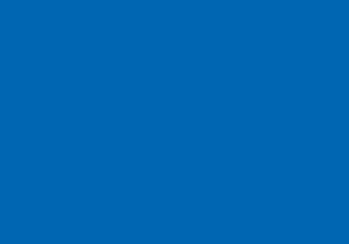

# Grohe Sense Guard for Athom Homey Pro

Integrates the **Grohe Sense Guard** smart water controller with **Athom Homey Pro** (Homey SDK v3).

<p align="center">
  
</p>

## Features

- **Valve Control**: Open and close your main water supply valve directly from Homey and Flows.
- **Insights & Metrics**:
  - 🌡 **Water Temperature** (`°C`)
  - ⏱ **Water Pressure** (`bar`)
  - 🌊 **Flow Rate** (`l/min`)
  - 📊 **Water Consumption Today** (`l`)
  - 📈 **Total Water Consumption** (`l`)
- **Alarms**:
  - 🚨 **Water Leak Alarm** (Pipe break, flooding, unusual water consumption, Sense sensor detections)
  - 🔬 **Micro Leak Alarm**
  - ❄️ **Frost Warning**
- **Flow Cards**:
  - **Triggers (When)**: Valve opened/closed, leak detected, leak alarm cleared, micro leak detected, frost warning, pressure changed, today's consumption changed.
  - **Conditions (And)**: Valve is open/closed, leak alarm active, pressure above/below, micro leak active, frost warning active.
  - **Actions (Then)**: Open valve, Close valve, Toggle valve, Refresh data from cloud.

## Installation & Setup

1. In Homey app, go to **Devices** &rarr; **+** &rarr; **Grohe Sense** &rarr; **Grohe Sense Guard**.
2. Retrieve your Grohe Ondus **Refresh Token**:
   - Open browser developer tools (<kbd>F12</kbd> &rarr; *Network* tab).
   - Go to `https://idp2-apigw.cloud.grohe.com/v3/iot/oidc/login` and log in.
   - Look for the request starting with `ondus://.../token?...`.
   - Open that URL replacing `ondus://` with `https://`.
   - Copy the value of `"refresh_token": "..."`.
3. Paste the token in the pairing screen and choose your Sense Guard.

## Vibe Coding & Acknowledgements

This app was built using **vibe coding** (AI-assisted software engineering). All credit and sincere gratitude go to the open source contributors who reverse-engineered, documented, and published details about the Grohe Ondus API:

- **Frank Aune ([@faune](https://github.com/faune))** – Creator of [`homebridge-grohe-sense`](https://github.com/faune/homebridge-grohe-sense), whose comprehensive Ondus API implementation and notification categorization provided indispensable reference material.
- **FlorianSW ([@FlorianSW](https://github.com/FlorianSW))** – Early pioneer of [`grohe-ondus-api-java`](https://github.com/FlorianSW/grohe-ondus-api-java).
- **Gunnar Kreitz ([@gkreitz](https://github.com/gkreitz))** – Developer of [`homeassistant-grohe_sense`](https://github.com/gkreitz/homeassistant-grohe_sense).
- **Patrick Nitsch ([@patricknitsch](https://github.com/patricknitsch))** – Maintainer of [`ioBroker.grohe-smarthome`](https://github.com/patricknitsch/ioBroker.grohe-smarthome).

## Disclaimer

This app is an independent community project and is not officially affiliated with, endorsed by, or maintained by GROHE AG. Grohe and Grohe Sense are registered trademarks of GROHE AG.

## Development

```bash
cd /Users/johan/Desktop/Homey/net.lindbom.grohe
homey app validate -l verified
homey app run
```
